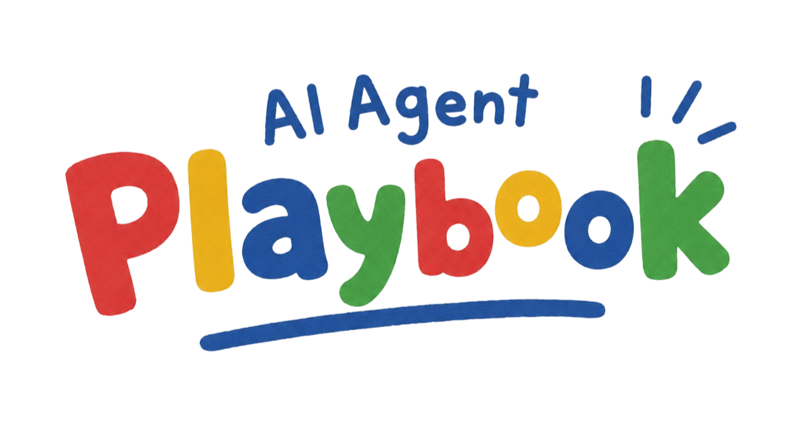

<p align="center">
  
</p>

<h1 align="center">AI Agent Playbook</h1>

<p align="center">
  A practical, reusable playbook for AI agents that need to work carefully inside real software repositories.
</p>

<p align="center">
  <a href="LICENSE"></a>
  <a href="https://www.npmjs.com/package/ai-agent-playbook"></a>
  
  
  
</p>

## Languages

- English (canonical): this file
- Korean (한국어): [README.ko.md](translations/ko/README.ko.md)

## What This Is

AI Agent Playbook is a small shelf of reusable agent skills, project templates, project-memory guides, a dependency-light runtime CLI, and a local MCP tool server for read-only analysis.

It helps coding agents stop guessing. The playbook nudges agents to inspect the repository first, respect local rules, keep API boundaries clear, write useful worklogs, and verify changes before calling work done.

The repository is agent-agnostic. Codex, Claude Code, and other coding agents can use the same source material, while `adapters/` keeps agent-specific setup notes separate.

It is not a slash-command pack, a Codex plugin, or an auto-running agent. The default model is operator-in-the-loop: a human or agent explicitly runs the CLI, reviews dry-run output, then chooses whether to write files. MCP is an optional local tool surface so an AI app can call read-only diagnostics by name when you ask in natural language.

## What You Get

| Piece             | What it does                                                                                        | Where it lives     |
| ----------------- | --------------------------------------------------------------------------------------------------- | ------------------ |
| Reusable skills   | Trigger-focused operating guides for onboarding, docs, quality, Git, meta work, and legacy systems. | `skills/`          |
| Project templates | Copyable root agent rules, stack profiles, and project-memory files for current facts, vocabulary, maps, decisions, and evidence. | `templates/`       |
| Runtime harness   | A small CLI for bootstrapping `.ai-playbook/`, health checks, context, runs, contracts, plans, and worklogs. | `bin/`, `src/`     |
| MCP tools         | Local read-only tools, resources, and prompts for AI apps: catalogs, adapter support/readiness, reference adoption, playbook layout, permission model, index search, write-gate preview, context, operator checks, research, contracts, image diff, AST search, clone cues, and TypeScript/JavaScript analysis. | `src/`             |
| Human docs        | Installation, classification, maintenance, publishing, and translation notes.                       | `docs/`            |
| Translations      | Korean reading copies that mirror English source files.                                             | `translations/ko/` |
| Agent adapters    | Setup notes for specific agent environments.                                                        | `adapters/`        |

## Quick Start

The package is published as [`ai-agent-playbook`](https://www.npmjs.com/package/ai-agent-playbook). The simplest path is to run it through npm with `npx`:

```powershell
npx ai-agent-playbook --help
npx ai-agent-playbook skills install --dry-run
npx ai-agent-playbook skills install
npx ai-agent-playbook bootstrap <target-project> --dry-run
npx ai-agent-playbook bootstrap <target-project>
npx ai-agent-playbook operator check <target-project> --json
```

New to this playbook? Start with [First 10 minutes](docs/quick-start.md). It explains what `npx`, global install, skills, and project bootstrap do before you write files.

In examples, names inside angle brackets are placeholders. Replace `<target-project>` with the project folder you want to inspect, or use `.` when your terminal is already inside that project. Quote paths that contain spaces, and keep private local paths out of shared issues, docs, and PRs.

If your AI app supports MCP, register a local server command such as `npx ai-agent-playbook mcp`. Then you can ask the AI to inspect playbook context, read the capability/skill/workflow/adapter/reference-adoption resources, run operator search, or do deep local analysis without remembering every CLI command. MCP tools are read-only by default.

If you want the shorter `ai-playbook` command from any directory, install the package globally:

```powershell
npm install -g ai-agent-playbook
ai-playbook --help
```

The npm package installs the CLI. It does not automatically copy skills, create `.ai-playbook/`, enable hooks, or register slash commands. Keep those actions explicit:

- `skills install`, `skills update`, and `skills uninstall` manage reusable user-level skills.
- `bootstrap`, `guides sync`, `managed *`, `contracts *`, `operator *`, and `qa *` manage or inspect one target project.
- `mcp` starts a local stdio MCP server for AI apps. It does not write files by itself.
- Runtime hooks and adapter settings are optional and are never installed by default.

For command-by-command usage, see [Command guide](docs/commands.md). For update, uninstall, local checkout, PowerShell compatibility, ownership markers, and cleanup details, see [Install, update, and uninstall](docs/installation.md).

## Everyday Flow

```text
npx or global install
  -> skills install or update
  -> restart the agent
  -> inspect the target project
  -> bootstrap .ai-playbook/ only when the project needs local playbook files
  -> use operator checks/search and managed cleanup as explicit commands
```

For existing projects, start with a dry run and inspect conflicts before writing files:

```powershell
npx ai-agent-playbook bootstrap <target-project> --local-only --dry-run
npx ai-agent-playbook bootstrap <target-project> --local-only
npx ai-agent-playbook operator check <target-project> --json
npx ai-agent-playbook operator preflight <target-project> --intent "planned change" --json
npx ai-agent-playbook operator research <target-project> --query "project risks" --json
```

See [Command guide](docs/commands.md) for search, managed cleanup, adapter setup, plan, and worklog commands.

After bootstrapping `.ai-playbook/`, agents should start from `START_HERE.md`, then read `CURRENT.md`, `questions.md`, relevant memory/maps/contracts, and the matching workflow recipe. Generated files under `runtime/` are evidence candidates, not trusted memory, until reviewed and promoted.

## Repository Map

```text
bin/                  ai-playbook CLI entrypoint
src/                  CLI runtime implementation
skills/
  ai-harness/        MCP, skill, agent, context, fact gate, witness, cache, and index design skills
  architecture/      Boundary, feature slice, domain model, and monorepo/package architecture skills
  backend/           API, backend change safety, connector, and server-rendered flow skills
  data/              Data pipeline, analytics, source registry, reporting, and migration integrity skills
  database/          Schema, migration, SQL, and data integrity skills
  delivery/          Planning, eval, verification, testing, Git, PR, and worklog skills
  devops/            CI/CD, container, package release, deployment, and operations triage skills
  design/            Design direction, brand identity, reference analysis, and image/Figma handoff skills
  frontend/          UI, browser, state/data, accessibility, visual QA, design-system, and interactive media skills
  mobile/            Native release, permission, offline sync, hybrid, WebView, and device QA skills
  security/          Auth, dependency supply chain, license/notice, security review, compliance gate, and risk skills
  project/            Bootstrap, onboarding, project planning, documentation, and project-memory skills
  quality/            UI quality, cleanup, and review skills
  git/                Commit, PR, push, and worklog skills
  meta/               Skill-authoring skills
  legacy/             Legacy-system maintenance skills
templates/
  agents/             Root agent instruction templates and project profiles
  codex-home/         Optional personal Codex home AGENTS.md template
  project-playbook/   Copyable ai-playbook project-memory template
examples/             Worklog, prompt, and handoff examples
translations/         Human translations; never install these as skills
adapters/             Agent-specific install notes and optional hook PoCs
docs/                 Classification, installation, publishing, and maintenance notes
docs/assets/          README and documentation images
scripts/              Validation and local sync helpers
test/                 Node CLI and adapter tests
.github/              GitHub Actions validation workflow
```

## Skill Catalog

Each `SKILL.md` is short and trigger-focused. Longer reusable detail belongs in `references/`.

For the category-by-category index, see [Skill catalog](docs/skill-catalog.md).

### Project

- `project-bootstrap`: start a new project, inherit a repository, or set up project memory and root agent guidance.
- `repo-onboarding`: inspect an unfamiliar repository before planning architecture, tooling, edits, or workflow answers.
- `project-doc-system`: create, reorganize, or review project AI docs, maps, runbooks, decisions, plans, and worklogs.
- `adr-spec-handoff`: turn decisions, architecture constraints, specs, milestone outcomes, worklogs, or handoffs into durable project memory.
- `requirements-prd-scope-review`: turn broad requests, stakeholder notes, or feature ideas into PRDs, specs, scope boundaries, acceptance criteria, and open questions.
- `issue-planning-triage`: convert specs, bugs, review findings, worklogs, and follow-ups into scoped issues, priorities, dependencies, and task batches.
- `release-notes-changelog`: prepare user-facing release notes, internal changelogs, migration notes, rollback notes, known issues, and verified change summaries.
- `documentation-artifact-package`: bundle docs, runbooks, diagrams, screenshots, reports, source references, and evidence into stakeholder packages, handoffs, or knowledge artifacts.

### Quality

- `ui-style-policy`: select, document, or enforce a repository UI styling policy.
- `style-quality-review`: review or improve UI styling, responsive behavior, layout overflow, and visual regressions.
- `frontend-ui-polish`: implement or refine visible frontend UI surfaces while preserving product intent and existing design conventions.
- `cleanup-ai-slop`: clean low-trust, overcomplicated, duplicated, or mechanically generated code while preserving behavior.
- `review-work-light`: review recent implementation work before handoff without starting a blocking review process.

### Design

- `design-brief-direction`: turn a vague product, page, brand, or UI request into a design direction, visual language, constraints, and decision-ready brief.
- `brand-identity-system`: define, review, or apply brand identity, typography, color, logo direction, iconography, voice, or visual identity rules.
- `design-reference-analysis`: analyze screenshots, competitor sites, reference apps, visual samples, or design boards before implementing or refactoring UI.
- `image-to-code-handoff`: turn generated images, screenshots, mockups, reference boards, or Figma frames into implementation-ready UI specs and verification criteria.

### Git and Meta

- `commit-worklog-guardrails`: stage, commit, push, open PRs, prepare release notes, or record worklogs.
- `agent-skill-authoring`: create, review, or reorganize reusable agent skills and references.

### Harness OS v2 Capabilities

- `mcp-server-design`: design MCP tools, resources, prompts, permission tiers, write gates, and cache/index surfaces.
- `context-engineering-memory-design`: design or review agent instructions, context surfaces, prompt/cache budget, project memory, compaction behavior, durable memory promotion, or stale fact handling.
- `agent-orchestration-handoff`: split work across agents, subagents, workers, review passes, or long-running handoffs with bounded contracts and evidence ledgers.
- `skill-pack-governance`: add, reorganize, review, or adopt skill packs, taxonomy categories, compatibility wrappers, reference routing, translations, install/sync behavior, or reusable skill governance.
- `runtime-index-cache-design`: design or review runtime reports, indexes, graphs, caches, artifact schemas, invalidation, canon promotion, generated evidence, or local-only runtime storage.
- `capability-witness-history`: design or review append-only capability witnesses, baseline comparison, skipped/degraded status, and runtime reliability history.
- `pre-action-fact-gate`: gather concrete facts before broad, destructive, owner-creating, or high-blast-radius actions.
- `evidence-locator-integrity`: check claims, reports, citations, memory updates, or handoffs for reopenable locators, scan ranges, freshness, confidence, source boundaries, and generated-evidence caveats.
- `boundary-review`: review FSD, layered, DDD, monorepo, package ownership, dependency direction, and coupling boundaries.
- `feature-slice-boundary`: change or review FSD, feature-sliced, vertical-slice, feature-first, route-level, module-level, or component-domain boundaries.
- `domain-model-change`: change or review domain entities, aggregates, value objects, services, policies, use cases, repositories, adapters, invariants, or transaction boundaries.
- `monorepo-package-boundary`: change or review monorepo packages, workspace dependencies, package exports, internal libraries, build graphs, generated types, and cross-package release impact.
- `api-contract-boundary`: implement, debug, or review frontend/backend contracts, DTOs, mocks, payloads, and adapters.
- `backend-change-safety`: change backend services, modules, workers, jobs, integrations, queues, config, or server-side business logic, with stack profiles selected only after repository evidence.
- `connector-integration-change`: change API connectors, workflow nodes, MCP adapters, webhooks, OAuth apps, import/export bridges, sync jobs, connector registration, or credential handling.
- `server-rendered-change`: change backend-rendered controllers, templates, forms, sessions, redirects, validation, and view contracts.
- `data-pipeline-review`: review analytics pipelines, ETL, batch jobs, data contracts, dashboards, and quality checks.
- `analytics-reporting-review`: review metrics, dashboards, reports, KPI definitions, chart/table consistency, analytics queries, freshness, and caveats.
- `data-migration-integrity`: plan, review, or verify data migrations, backfills, warehouse transformations, reconciliation, idempotency, rollback, and data repair.
- `data-contract-lineage-review`: review dataset contracts, lineage, source-of-truth ownership, freshness targets, schema/grain changes, and downstream consumer impact.
- `data-quality-observability`: design or review data quality checks, freshness alerts, anomaly detection, null/duplicate/orphan checks, quarantine, repair, and data incident handoff.
- `analytics-instrumentation-review`: review tracking plans, event schemas, analytics instrumentation, funnels, cohorts, experiments, attribution, consent, and downstream metric impact.
- `knowledge-retrieval-pipeline-review`: review document ingestion, parsing, chunking, metadata, embeddings/vector stores, retrieval quality, citations, access control, and stale RAG/search indexes.
- `knowledge-source-registry`: register project knowledge sources with owner, status, freshness, locator, credential boundary, and promotion rules.
- `database-change-safety`: change database schema, migrations, SQL, reporting queries, stored procedures, or data integrity rules.
- `schema-migration-plan`: plan or review database schema migrations, DDL, indexes, constraints, defaults, nullability, seeds, views, triggers, stored procedures, or expand/contract rollout steps.
- `query-performance-review`: review slow SQL, reporting queries, dashboard queries, API list/detail queries, exports, aggregates, joins, sort/pagination, full scans, N+1 patterns, or index choices.
- `data-integrity-constraints`: change database constraints, uniqueness, foreign keys, checks, not-null rules, triggers, stored procedures, generated columns, repair scripts, reconciliation queries, or invariant boundaries.
- `git-worklog-guardrails`: primary delivery skill for staging, commits, PR text, release notes, and worklogs.
- `eval-harness-design`: define or review agent, harness, workflow, MCP, prompt, capability, regression, grader, and release-gate evals.
- `test-verification-strategy`: plan or review risk-based verification, test scope, check selection, coverage gaps, and release confidence.
- `ci-quality-gate`: define or review required checks, optional checks, skipped checks, stale evidence, and merge/release gate decisions.
- `flaky-test-triage`: diagnose, reproduce, stabilize, quarantine, or document flaky and nondeterministic tests.
- `test-fixture-data-design`: design or repair fixtures, factories, mocks, seeds, snapshots, golden files, and test data boundaries.
- `ci-failure-triage`: diagnose failing CI jobs, build pipelines, deployments, flaky tests, and environment drift.
- `container-change-safety`: change Dockerfiles, container images, Compose/Kubernetes manifests, runtime config, healthchecks, volumes, or networks.
- `deployment-release-check`: prepare, review, or troubleshoot releases, deploys, rollbacks, feature flags, artifacts, migration gates, and post-deploy checks.
- `package-publish-readiness`: prepare, review, or troubleshoot package publishing, release artifacts, package metadata, registry dry-runs, generated bundles, binaries, or marketplace distribution.
- `observability-incident-triage`: triage incidents, production errors, alerts, latency, error rates, queue backlogs, job failures, logs, metrics, and traces.
- `design-brief-direction`: create design direction briefs before visual implementation or redesign work.
- `brand-identity-system`: define or review identity systems, typography, colors, logo usage, iconography, and brand application rules.
- `design-reference-analysis`: extract reusable visual principles and evidence from design references without copying upstream visuals.
- `image-to-code-handoff`: convert images, screenshots, mockups, reference boards, or Figma frames into UI contracts.
- `browser-dom-change`: change browser DOM behavior, jQuery flows, event handlers, selectors, forms, plugins, or script-loaded UI.
- `frontend-state-data-flow`: change frontend state ownership, server/client cache behavior, data fetching, optimistic updates, URL state, or stale UI bugs.
- `frontend-accessibility-review`: review keyboard access, focus management, semantics, forms, dialogs, menus, announcements, contrast, and accessible states.
- `ui-polish`: primary frontend skill for visible UI, responsive layout, accessibility states, interaction feedback, and production polish.
- `visual-regression-qa`: check screenshots, responsive breakpoints, layout overflow, clipping, visual diffs, text fit, canvas/media rendering, and browser-rendered UI regressions.
- `interactive-media-3d-review`: implement or review Three.js, WebGL, canvas, SVG, chart, map, animation, video, and media-heavy interactive UI surfaces.
- `design-system-handoff`: turn Figma, brand, token, component-library, theme, variant, or visual-spec guidance into maintainable frontend implementation.
- `native-release-readiness`: prepare, review, or troubleshoot mobile releases, signing, provisioning, build channels, store distribution, artifacts, and release-build cleanup.
- `device-permission-qa`: change or verify mobile runtime permissions, device capabilities, manifests, privacy prompts, lifecycle behavior, and device/emulator QA matrices.
- `offline-sync-review`: change or review mobile offline mode, local cache, durable queues, sync jobs, conflict resolution, retries, idempotency, and network transitions.
- `webview-bridge`: change WebView bridges, native-to-web messaging, deep links, embedded auth, uploads, downloads, or hybrid navigation.
- `legacy-change-safety`: primary legacy skill for compatibility-first changes with hidden coupling or deployment risk.
- `security-review`: review secrets, authentication, authorization, input validation, dependency risk, and sensitive data flow.
- `auth-access-control`: change login, sessions, OAuth/OIDC, JWTs, RBAC, permissions, roles, tenants, scopes, or object-level authorization.
- `dependency-supply-chain-review`: change dependencies, lockfiles, SBOMs, licenses, containers, package scripts, provenance, or vulnerability remediation.
- `license-notice-review`: review first-party licenses, third-party notices, attribution, vendored code, generated artifacts, copied snippets, dual-license choices, redistribution scope, or compliance evidence.
- `security-compliance-gate`: decide security or compliance gates before merge, release, publication, or handoff.

### Legacy

General legacy work:

- `legacy-general`: maintain or extend legacy code with unclear flow, hidden coupling, weak tests, or mixed documentation.
- `legacy-risk-check`: check hidden blast radius before changes that may affect shared state, CSS/JS, selectors, templates, forms, APIs, builds, or deploys.
- `legacy-feature-addition`: add behavior, screens, fields, business rules, or integrations without rewriting the host system.

Web, mobile, and compatibility surfaces:

- `legacy-jquery-web`: maintain jQuery, plugins, direct DOM manipulation, global scripts, AJAX callbacks, or script-order coupling.
- `legacy-server-rendered-web`: maintain templates, controllers, form posts, server validation, sessions, layouts, and partials.
- `legacy-php-lamp`: maintain PHP/LAMP pages with includes, sessions, mixed HTML/PHP, direct SQL, globals, or shared hosting limits.
- `legacy-android-webview-hybrid`: maintain Android WebView apps with web assets, JavaScript bridges, permissions, or device APIs.
- `legacy-ie-activex-compat`: maintain intranet systems that depend on IE mode, ActiveX, old browser APIs, or compatibility constraints.

Enterprise stacks and data-heavy flows:

- `legacy-java-spring-mvc`: maintain Spring MVC, JSP, Servlet, MyBatis, WAR deployment, XML config, or server-rendered Java apps.
- `legacy-dotnet-webforms`: maintain ASP.NET Web Forms, .NET Framework, code-behind, ViewState, Web.config, IIS, or old enterprise .NET apps.
- `legacy-database-heavy-system`: maintain stored procedures, triggers, views, direct SQL, scheduled jobs, or database-shaped business rules.
- `legacy-reporting-printing`: maintain reports, print preview, PDF/Excel export, labels, barcodes, invoices, or printer-specific flows.
- `legacy-batch-file-transfer`: maintain scheduled batches, cron jobs, Windows Task Scheduler, CSV/Excel import/export, SFTP, or file drops.

## Documentation

- [Repository working rules](AGENTS.md): maintenance rules for agents editing this repository.
- [Repository context](CONTEXT.md): core terms and design intent for the playbook.
- [First 10 minutes](docs/quick-start.md): beginner-friendly first run, glossary, and safe command order.
- [Command guide](docs/commands.md): what each CLI command does, when to use it, and whether it writes files.
- [Install, update, and uninstall](docs/installation.md): npm/npx usage, global CLI setup, skill lifecycle, project bootstrap, cleanup, and legacy PowerShell paths.
- [Runtime harness](docs/harness-runtime.md): runtime principles, JSON contract notes, overwrite policy, and target-project flow.
- [Harness OS](docs/harness-os.md): v1 redesign principles for catalogs, layout, runtime, MCP, and skills.
- [Playbook layout v2](docs/playbook-layout-v2.md): `.ai-playbook` v2 directory roles and migration commands.
- [Skill taxonomy v2](docs/skill-taxonomy-v2.md): capability-first categories and compatibility wrapper policy.
- [Skill catalog](docs/skill-catalog.md): long-form skill list and trigger summary.
- [MCP permission model](docs/mcp-permission-model.md): read, scaffold, managed-write, and project-write tiers.
- [Reference adoption](docs/reference-adoption.md): how to distill external references into local capabilities without prompt noise.
- [Runtime roadmap](docs/runtime-roadmap.md): staged hardening plan and optional hook-layer boundaries.
- [Codex adapter](adapters/codex/README.md): Codex-specific local sync behavior and Codex App on Windows workflow.
- [Claude Code adapter](adapters/claude-code/README.md): Claude Code setup notes and optional read-only context hook example.
- [Templates](templates/README.md): what to copy into project repositories and what to leave as installable skills.
- [Classification](docs/classification.md): why skills, templates, examples, docs, and adapters are separated.
- [Superpowers integration](docs/superpowers-integration.md): how to use this playbook alongside external process skills.
- [Maintenance workflow](docs/maintenance.md): what to update together when adding or changing content.
- [Translation policy](docs/translation-policy.md): English source and Korean translation rules.
- [Publishing checklist](docs/publishing-checklist.md): pre-publish hygiene checks.

## For Maintainers

This README is the public entry point for users. If you are editing this source repository, read [Repository working rules](AGENTS.md) and [Maintenance workflow](docs/maintenance.md) first. Release hygiene lives in [Publishing checklist](docs/publishing-checklist.md).

Keep English source files canonical, update Korean translations with English source edits, and do not commit personal paths, credentials, internal URLs, branch names, PR numbers, or installed local skill copies.

## License

Licensed under [MIT](LICENSE).
