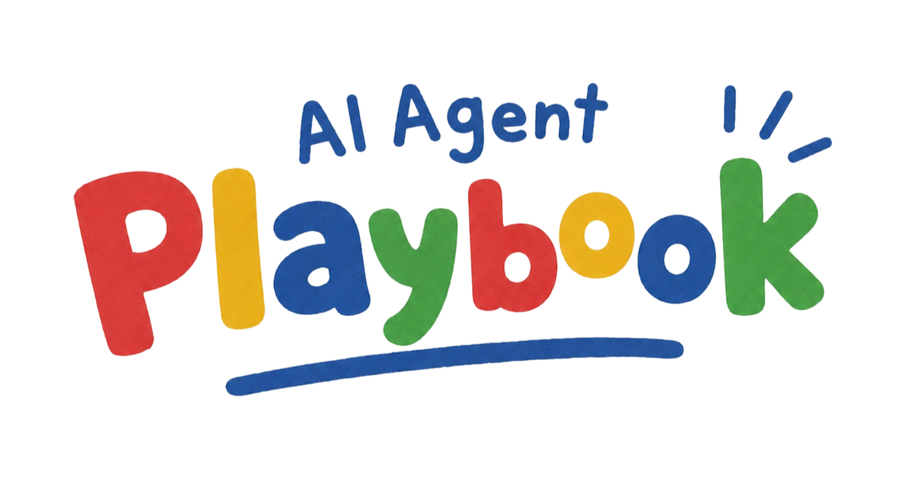

<p align="center">
  
</p>

<h1 align="center">AI Agent Playbook</h1>

<p align="center">
  실제 소프트웨어 저장소에서 안전하고 일관되게 일해야 하는 AI 에이전트를 위한 재사용 작업 지침 모음입니다.
</p>

<p align="center">
  <a href="../../LICENSE"></a>
  <a href="https://www.npmjs.com/package/ai-agent-playbook"></a>
  
  
  
  
</p>

## 언어

- 영어 원문: [README.md](../../README.md)
- 한국어: 이 문서

## 이 저장소는 무엇인가

AI Agent Playbook(AAPB)은 코딩 에이전트와 함께 작업할 때 프로젝트의 현재 상태와 결정 근거를 남기고, 명세·인수인계·디자인·문서를 정리하는 데 쓰는 도구 모음입니다. 재사용 스킬, 복사해서 쓸 템플릿, 명령줄 도구, 선택형 읽기 전용 MCP 서버를 제공합니다.

현재 목표, 제약, 확인한 사실, 다음 할 일은 `CURRENT.md`에 적습니다. 자세한 결정이나 검증 근거가 필요하면 별도 문서를 만들고 링크합니다. 기록은 일반 Markdown과 JSON 파일이므로 평소 쓰는 편집기나 에이전트로 읽고 수정할 수 있습니다.

특정 에이전트에 묶이지 않습니다. Codex, Claude Code 등에서 같은 기록과 참고 자료를 사용할 수 있으며, 도구별 설정은 `adapters/`에서 따로 설명합니다.

1.0은 프로젝트 기록, 산출물 형식, 필요한 전문 지침에 집중합니다. 코드 실행과 예약 작업은 에이전트 앱이나 프로젝트의 기존 도구가 맡습니다. 0.5 버전을 사용했다면 [1.0 변경사항과 이전 버전](docs/redesign.ko.md)을 함께 확인하세요.

## 제공하는 것

| 구성 | 역할 | 위치 |
| --- | --- | --- |
| 재사용 스킬 | 프로젝트 기억, 명세·인수인계 형식, 디자인 방향, UI 다듬기, 문서 편집, 선택형 레거시 계약 | `skills/` |
| 참고 자료 | 이전 스킬의 분야별 계약·예시·예외 사항을 필요할 때 찾아보는 자료 | `references/` |
| 프로젝트 템플릿 | 루트 지침 예시와 현재 상태 문서. 상세 기록은 필요할 때 추가 | `templates/` |
| 명령줄 도구 | 스킬 설치, 기록 생성·조회, 이전·복구, 선택형 품질 점검, Forge 협업 | `bin/`, `src/` |
| MCP 도구 | 지정한 프로젝트의 상태·검색·읽기·문서 검증을 제공하는 네 도구 | `src/` |
| 사용 안내 | 처음 시작하는 방법, 명령별 예시, 문제 해결, 구조와 배포 안내 | `docs/` |
| 한국어 문서 | 한국어 설명과 문서 탐색 경로를 제공하는 읽기용 문서 | `translations/ko/` |
| 에이전트 어댑터 | 에이전트 앱에 맞게 설치·연결하는 방법 | `adapters/` |

## 빠른 시작

Node.js 18 이상에서 npm 패키지를 설치합니다.

```sh
npm install -g ai-agent-playbook
ai-agent-playbook --help
```

패키지 이름과 기본 명령은 모두 `ai-agent-playbook`입니다. `aapb`는 같은 옵션과 기능을 제공하는 축약 명령입니다. 전역 설치 없이 가끔 실행하려면 `npx ai-agent-playbook --help`를 사용할 수 있습니다. 일반적인 사용에는 소스 체크아웃이나 PowerShell 설치 스크립트가 필요하지 않습니다.

재사용 스킬은 따로 선택합니다. 개발 프로필을 미리 보고 결과를 확인한 뒤 설치하세요.

```sh
ai-agent-playbook skills install --profile development --dry-run --json
ai-agent-playbook skills install --profile development --json
ai-agent-playbook skills check --profile development --json
```

에이전트에서 스킬 목록을 다시 불러오거나 새 세션을 시작합니다. 파일 설치와 실제 앱 로딩은 별도로 확인합니다.

프로젝트 폴더에서 아래 명령을 실행하세요. 프로젝트 경로를 생략하면 현재 터미널의 작업 폴더를 사용합니다.

```sh
ai-agent-playbook records status --json
ai-agent-playbook bootstrap --dry-run
ai-agent-playbook bootstrap
ai-agent-playbook records read --path CURRENT.md
```

Bootstrap은 기존 `AGENTS.md`와 기록을 보존합니다. 새 플레이북에는 `CURRENT.md`와 관리 파일 두 개를 만듭니다. Git 저장소에서 기록을 로컬에만 두려면 두 bootstrap 명령에 모두 `--local-only`를 붙입니다.

다른 폴더를 대상으로 삼으려면 `ai-agent-playbook bootstrap "<project>" --dry-run`처럼 경로를 붙이거나 `--project "<project>"`를 사용하세요. [명령어 가이드](docs/commands.ko.md)에서 전체 명령 조합과 옵션별 뜻을 설명합니다.

[처음 10분 사용법](docs/quick-start.ko.md)에서 연습 프로젝트, 용어, 예상 결과, 문제 해결을 확인할 수 있습니다. 업데이트·삭제·버전 선택·복구는 [설치 안내](docs/lifecycle.ko.md)에 있습니다.

패키지 설치, 스킬 설치, 기록 생성, MCP 등록은 각각 별도 작업입니다. Python은 일부 문서 점검에만 선택해서 사용합니다. [실행 환경](docs/runtime-engines.ko.md)을 참고하세요. 개발자는 [유지보수](docs/maintenance.ko.md)와 [로컬 패키지 시험](docs/demo.ko.md) 안내를 사용할 수 있습니다.

## Forge 협업과 실행 환경

Forge는 GitHub나 Gitea처럼 이슈와 코드 리뷰를 관리하는 서비스를 뜻합니다. AAPB는 협업 계획을 미리 보여주고, 명시적으로 적용한 경우 기존 관리 항목을 재사용하며 원격 상태 충돌이나 일부 작업의 실패를 알려줍니다. 프로젝트 작업을 대신 실행하거나 예약하지는 않습니다.

| 구성 요소 | 필요한 경우 | 확인할 점 |
| --- | --- | --- |
| Node.js `18+` | CLI와 MCP 사용 | 패키지의 최소 조건입니다. 실제 검증 버전은 검증 보고서에 따로 적습니다. |
| Git | 소스 복제·갱신, `--local-only`, Forge 원격 확인 | 일반적인 기록 조회에는 원격 저장소가 필요하지 않습니다. |
| Python `3.11+` | 선택형 문서 점검 엔진 | 기본 기록 기능과 JavaScript 문서 점검은 Python 없이 사용할 수 있습니다. |
| GitHub / Gitea 접근 권한 | 협업 계획을 원격에 적용 | 로컬 미리보기만으로 로그인이나 원격 쓰기 권한을 확인한 것은 아닙니다. |
| MCP 지원 에이전트 앱 | 선택형 MCP 연결 | 파일을 직접 편집하거나 CLI만 사용해도 됩니다. |

[Forge 협업 안내](docs/forge-automation.ko.md)에서 명령 예시와 인증 범위를, [검증 보고서](docs/verification.ko.md)에서 모의 전송 검사와 실제 실행 검증의 차이를 확인할 수 있습니다.

## 평소 작업 흐름

```text
검증한 CLI 버전 선택
  -> 필요한 스킬 설치 후 에이전트에서 다시 불러오기
  -> 기존 프로젝트 점검 또는 새 기록 생성 미리보기
  -> CURRENT.md와 관련 상세 문서 읽기
  -> 프로젝트의 기존 도구로 구현·테스트
  -> 확인한 사실, 근거, 다음 할 일 갱신
```

예를 들어 에이전트에게 “CURRENT.md와 연결된 API 결정 문서를 읽고, 요청한 변경을 구현한 뒤 저장소 검사를 실행해 줘. 결과와 다음 할 일을 현재 상태에 기록해 줘.”라고 요청할 수 있습니다. AAPB는 기록 형식을 제공하고, 실제 작업 방식은 프로젝트의 기존 지침을 따릅니다.

근거를 찾거나 기록 사이의 일관성을 확인할 때는 다음 명령을 사용합니다.

```sh
ai-agent-playbook records search "<project>" --query "API decision" --json
ai-agent-playbook records validate "<project>" --json
```

이 검증은 기록·링크·관리 파일 변경 여부를 확인합니다. 애플리케이션 테스트를 실행하거나 오래된 문장을 현재 사실로 확인해 주지는 않습니다. 긴 결과를 이어 읽는 방법은 [응답 크기와 이어 읽기](docs/record-responses.ko.md)에 있습니다.

## 기능 목록

### 스킬과 작업 지침

설치 가능한 스킬은 여섯 개입니다. 기본 `core`는 두 개, `development`는 다섯 개, `legacy`는 레거시 계약 스킬 하나를 선택합니다. 스킬별 참고 자료는 함께 설치되며, 이전의 큰 참고 자료 모음은 필요한 내용만 찾아 읽습니다.

### `.ai-agent-playbook/` 프로젝트 기억

새 프로젝트는 `CURRENT.md`에서 시작합니다. 명세·결정·검증·인수인계는 필요할 때 추가하고 링크합니다. 기존 구조화 기록과 구버전 폴더도 계속 읽을 수 있습니다. 이전 도구가 과거 기록을 자동으로 요약하거나 루트 지침을 교체하지 않습니다.

### 기록 점검과 선택형 품질 검토

기록 검색, JSON과 링크 검사, 관리 파일 변경 확인을 제공합니다. 문서의 자연스러움·정보 보존과 UI의 정적 검토 후보를 찾는 명령도 선택해서 쓸 수 있습니다. 점수만으로 문체나 디자인을 고치지 않고 실제 문서와 화면을 함께 검토합니다.

### MCP 연동

`aapb_status`, `aapb_search`, `aapb_read`, `aapb_validate` 네 도구를 지정한 프로젝트에 연결합니다. 모두 읽기 전용이며, 설치만으로 켜지지 않습니다. 긴 결과는 크기를 조절하거나 다음 부분을 요청할 수 있습니다.

### 어댑터와 검증

Codex와 Claude Code의 설정 안내를 따로 제공합니다. 스킬 형식, 번역 대응, 공개 문서, CLI·설치·복구·MCP 동작을 검사합니다. 설치 파일 확인, 앱에서의 실제 로딩, 기능 실행 검증은 구분해서 기록합니다.

## 저장소 지도

```text
bin/                  ai-agent-playbook / aapb 공통 명령 진입점
src/                  기록·설치·MCP·문서 점검·Forge 구현
skills/
  project/            프로젝트 기억, 산출물 형식, 문서 편집
  design/             제품에 맞는 디자인 방향
  frontend/           실제 화면을 기준으로 한 UI 다듬기
  legacy/             선택형 레거시 시스템 보존 계약
references/           이전 카탈로그의 분야별 참고 자료
templates/            복사해서 쓸 루트 지침과 현재 상태 문서
examples/             작업 기록·프롬프트·인수인계 예시
translations/ko/      한국어 읽기용 문서. 별도의 설치형 스킬 목록이 아님
adapters/             에이전트별 설정 안내
docs/                 사용법·설계·검증 문서
docs/assets/          README와 문서용 이미지
scripts/              검증과 로컬 동기화 도우미
test/                 런타임과 어댑터 테스트
.github/              CI와 기여 양식
CONTEXT.md            용어와 설계 의도
CHANGELOG.md          버전별 변경 기록
```

## 스킬 카탈로그

| 프로필 | 포함하는 스킬 | 사용 목적 |
| --- | --- | --- |
| `core` (기본값) | `project-memory`, `spec-artifacts` | 프로젝트 상태 유지, 요청한 명세·결정·인수인계 작성 |
| `development` | Core + `design-brief-direction`, `ui-polish`, `natural-writing-humanization` | 개발과 함께 디자인·UI·문서를 다루는 작업 |
| `legacy` | `legacy-contracts` | 명시적으로 선택한 레거시 시스템 유지보수 |

`--skill`을 직접 지정하면 프로필 대신 그 목록을 사용합니다. 프로필은 작업 지침을 고르는 수단이며 권한 단계가 아닙니다. 사용 상황과 선택 예시는 [스킬 카탈로그](docs/skill-catalog.ko.md)에 있습니다.

이전의 94개 진입점은 통합하거나 종료했습니다. 유용한 분야별 내용은 [참고 자료 모음](references/README.ko.md)에 보존했고, [항목별 이전표](docs/skill-decisions.ko.md)에서 옮겨간 위치를 찾을 수 있습니다. 스킬 진입점을 짧게 유지하는 것과 사람용 사용 안내를 줄이는 것은 별개입니다.

## 문서

[문서 지도](docs/README.ko.md)에서 목적에 맞는 읽기 순서를 고르거나 아래 안내를 바로 열 수 있습니다.

- [저장소 맥락](CONTEXT.ko.md): 용어와 설계 의도.
- [처음 10분 사용법](docs/quick-start.ko.md): 초보자 실습, 용어, 예상 결과, 문제 해결.
- [명령어 가이드](docs/commands.ko.md): 명령·옵션·예시·쓰기 여부·종료 코드.
- [설치·업데이트·복구](docs/lifecycle.ko.md): 패키지와 스킬의 설치, 갱신, 삭제, 이전, 복구.
- [기존 저장소에 적용하기](docs/existing-repository-bootstrap.ko.md): 기존 기록과 프로젝트 지침 보존.
- [프로젝트 기록 구조](docs/structured-playbook-layout.ko.md): CURRENT.md 작성과 상세 문서 추가 기준.
- [런타임 구조](docs/harness-runtime.ko.md): 데이터 흐름, 소유권, 검증 범위.
- [MCP 설정과 권한](docs/mcp-permission-model.ko.md): 선택형 읽기 전용 도구 네 개 연결.
- [에이전트의 도구 활용](docs/agent-usage.ko.md): 스킬·도구의 사용 가능 여부와 실제 선택·실행을 구분하는 방법.
- [응답 크기와 이어 읽기](docs/record-responses.ko.md): 크기 조절과 긴 결과 읽기.
- [Forge 협업](docs/forge-automation.ko.md): 계획 검토, 원격 적용, 충돌, 재시도.
- [UI와 문서 품질 검토](docs/quality-review.ko.md): 제품 의도, 사실, 문체를 보존하며 검토하기.
- [실행 환경](docs/runtime-engines.ko.md): Node/Python 설정과 문제 해결.
- [로컬 패키지 시연](docs/demo.ko.md): npm에 게시하기 전에 압축 파일로 시험하기.
- [스킬 카탈로그](docs/skill-catalog.ko.md), [기능 선택 기준](docs/capability-taxonomy.ko.md), [참고 자료 활용](docs/reference-adoption.ko.md): 작업에 맞는 지침 고르기.
- [Codex 어댑터](adapters/codex/README.ko.md), [Claude Code 어댑터](adapters/claude-code/README.ko.md), [템플릿](templates/README.ko.md): 사용 환경에 맞춰 적용하기.
- [1.0 변경사항과 이전 버전](docs/redesign.ko.md), [검증 보고서](docs/verification.ko.md), [정식 버전 준비](docs/runtime-roadmap.ko.md): 변경 근거, 확인한 결과, 남은 조건.
- [유지보수](docs/maintenance.ko.md), [콘텐츠 분류](docs/classification.ko.md), [번역 정책](docs/translation-policy.ko.md), [배포 점검표](docs/publishing-checklist.ko.md): 기여와 릴리스 준비.
- [공통 환경 구성](docs/environment-profiles.ko.md), [외부 작업 절차 도구](docs/superpowers-integration.ko.md): 선택형 연동의 범위.
- [변경 기록](CHANGELOG.ko.md): 버전별 사용자 영향 변경.

## 라이선스

[MIT](../../LICENSE) 라이선스를 사용합니다.
